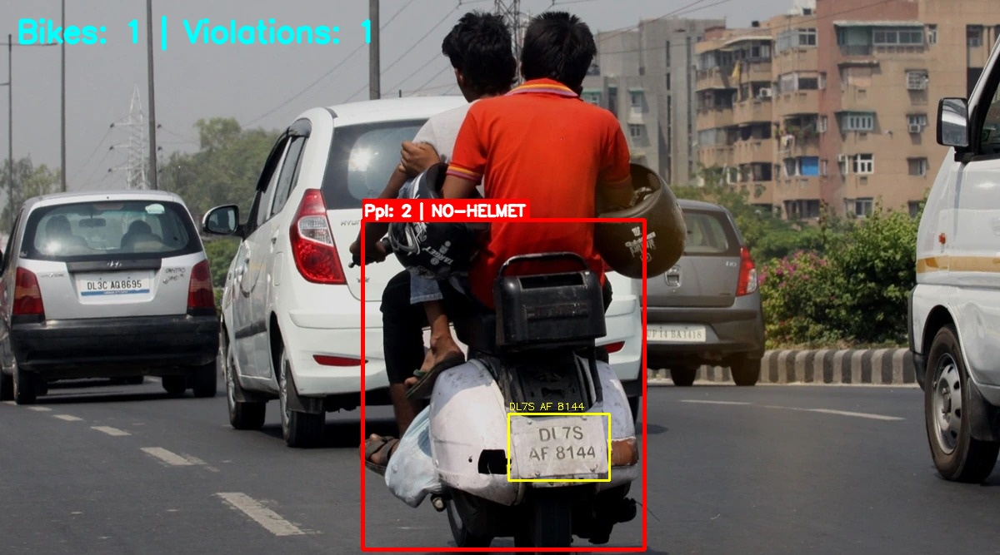
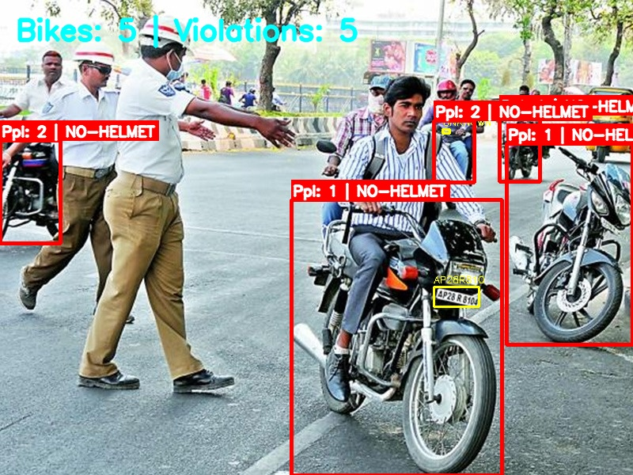
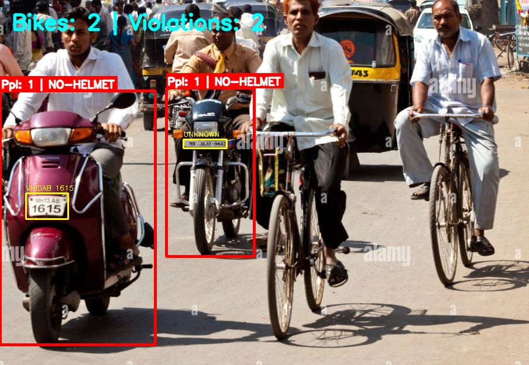
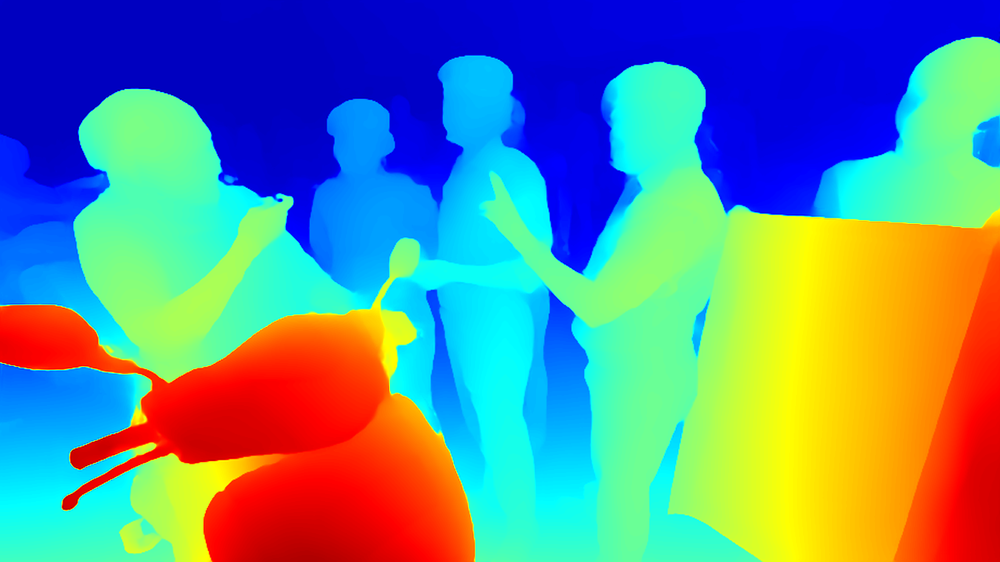

<div align="center">

# 🚨 Two-Wheeler Traffic Violation Detection

### A 5-Stage Cascaded Deep Learning Pipeline

**AID 728 · IIIT Bangalore · Semester 4 · Computer Vision**

*Navya Sharma (BT2024237) · Sparsh Agrawal (BT2024084) · Potini Sahiti (BT2024163)*

---


[Model Weights (Google Drive)](https://drive.google.com/drive/folders/1uanMnwPj8SAxNuYEqx8-8e2_D5zBRMXF?usp=sharing) · [Report (PDF)](CV-3.pdf) · [Quick Start](#-quick-start)

</div>

---

## 🎯 What This Does

Given **a single RGB street-camera image**, the system outputs a structured JSON record per two-wheeler — no video feed, no internet, no cloud APIs required.

```json
{
  "violations": [
    {
      "num_riders":        2,
      "helmet_violations": 1,
      "license_plate":     "DL 7S AF 8144"
    }
  ]
}
```

Every violating vehicle gets an entry. A vehicle is flagged when:
- **≥ 3 riders** share a single bike (over-riding), **OR**
- **≥ 1 rider** is without a helmet

---

## 🖼️ Inference Results

| Dual-rider, No Helmet — Plate Read | Dense Traffic — 5 Bikes |
|---|---|
|  |  |

| Busy Indian Street — Multi Bike |
|---|
|  |

---

## 🏗️ Pipeline Architecture

The system is a **5-stage cascade** — each stage operates on the outputs of the previous stage, minimising error propagation.

```
Input RGB Image
      │
      ▼
┌──────────────────────────────────────────────────────────┐
│  Stage 1 — Primary Detector (YOLOv8s · COCO pretrained) │
│  → person (cls 0) + motorcycle (cls 3) boxes             │
│  → 21.54 MB                                              │
└───────────────────────────┬──────────────────────────────┘
                            │
┌───────────────────────────▼──────────────────────────────┐
│  Stage 2 — Bike Supplement (Custom YOLOv8n)              │
│  → domain-specific two-wheeler detections                │
│  → merged with Stage 1 via NMS (IoU = 0.5)              │
│  → 21.49 MB                                              │
└───────────────────────────┬──────────────────────────────┘
                            │
┌───────────────────────────▼──────────────────────────────┐
│  Stage 3 — Spatial Association + Depth Filter            │
│  → Depth-Anything V2 Small (fp16 on disk, fp32 runtime) │
│  → rejects background pedestrians via depth proximity    │
│  → 47.31 MB                                              │
└───────────────────────────┬──────────────────────────────┘
                            │
                   ┌────────▼────────┐
                   │  Per-bike loop  │
                   └────────┬────────┘
                            │
┌───────────────────────────▼──────────────────────────────┐
│  Stage 4 — Helmet Classification (YOLOv11s custom)       │
│  → crops top 45% of each rider bbox (head region)        │
│  → with_helmet (0) / without_helmet (1)                  │
│  → mAP@50 = 93.3% · 5.22 MB                             │
└───────────────────────────┬──────────────────────────────┘
                            │
┌───────────────────────────▼──────────────────────────────┐
│  Stage 5a — License Plate Detector (YOLO custom)         │
│  → mAP@50 = 95.8% · 42.77 MB                            │
└───────────────────────────┬──────────────────────────────┘
                            │
┌───────────────────────────▼──────────────────────────────┐
│  Stage 5b — SR + OCR                                     │
│  → FSRCNN ×3 super-resolution → CLAHE → sharpening      │
│  → PaddleOCR 3.5.0 (mobile det + rec)                   │
│  → 56.25 MB                                              │
└───────────────────────────┬──────────────────────────────┘
                            │
                            ▼
                    JSON Output
```

### Depth Filtering in Action

Depth-Anything V2 produces a monocular depth map that disambiguates **foreground riders** from **background pedestrians** who share horizontal overlap with a bike in the 2D image plane.

<div align="center">



*Jet-colormap depth map — red = near, blue = far. The scooter (bottom-left) is clearly in the foreground; the police officers in the background are correctly excluded from bike-rider association.*

</div>

---

## 📊 Model Performance

### Stage 2 — Custom Two-Wheeler Detector

| Metric | Value |
|--------|-------|
| mAP@50 | 0.709 |
| mAP@50-95 | 0.432 |
| Precision | 0.827 |
| Recall | 0.646 |
| F1 (max) | 0.71 @ τ = 0.35 |
| Training data | 10,341 images (COCO + IDD) |

> **Design intent**: Stage 2 is deliberately precision-conservative — it supplements Stage 1 (COCO) without introducing false positives. The combined Stage 1+2 recall after NMS merging significantly exceeds either model individually.

### Stage 4 — Helmet Classifier (YOLOv11s)

| Metric | Value |
|--------|-------|
| mAP@50 (overall) | **93.3%** |
| mAP@50 (with_helmet) | 95.4% |
| mAP@50 (without_helmet) | 91.2% |
| Precision | 89.8% |
| Recall | 89.5% |
| Model size | **5.22 MB** |
| Parameters | 11.1 M |
| Inference speed | ~10 ms/image (T4 GPU) |

### Stage 5a — License Plate Detector

| Run | Configuration | mAP@50 | Precision | Recall |
|-----|--------------|--------|-----------|--------|
| 1 (Baseline) | YOLOv8n + noisy labels | 0.882 | 0.928 | 0.856 |
| 2 (**Final**) | YOLOv8s + sanitised data | **0.958** | **0.953** | **0.889** |

### Total Model Budget

| Stage | Model | Size |
|-------|-------|------|
| 1 | YOLOv8s (COCO pretrained) | 21.54 MB |
| 2 | YOLOv8n custom (two-wheeler) | 21.49 MB |
| 3 | Depth-Anything V2 Small (fp16) | 47.31 MB |
| 4 | YOLOv11s custom (helmet) | 5.22 MB |
| 5a | YOLO custom (license plate) | 42.77 MB |
| 5b | FSRCNN + PaddleOCR 3.5.0 | 56.25 MB |
| **Total** | | **194.59 MB / 250 MB** |

---

## ⚡ Quick Start

### 1. Get model weights

Download all weights from [Google Drive](https://drive.google.com/drive/folders/1uanMnwPj8SAxNuYEqx8-8e2_D5zBRMXF?usp=sharing) and place them in `./models/`:

```
models/
├── yolov8s.pt                          # COCO primary detector      (21.54 MB)
├── stage1_best.pt                      # Custom two-wheeler         (21.49 MB)
├── helmet_v11.pt                       # Helmet classifier          (5.22 MB)
├── license.pt                          # License plate localiser    (42.77 MB)
├── FSRCNN_x3.pb                        # Super-resolution           (0.04 MB)
├── depth_anything_v2/                  # Depth-Anything V2 Small    (47.31 MB)
└── paddleocr/
    └── official_models/
        ├── PP-OCRv5_mobile_det/        # Text detection             (4.71 MB)
        ├── en_PP-OCRv5_mobile_rec/     # Text recognition           (7.64 MB)
        ├── PP-LCNet_x1_0_doc_ori/      # Doc orientation            (6.55 MB)
        ├── PP-LCNet_x1_0_textline_ori/ # Text-line orientation      (6.54 MB)
        └── UVDoc/                      # Document unwarping         (30.76 MB)
```

### 2. Install dependencies

```bash
pip install -r requirements.txt
```

### 3. Run inference

**Python API (programmatic):**
```python
from solution import TrafficViolationDetector

detector = TrafficViolationDetector(model_dir="./models")
result   = detector.predict("path/to/image.jpg")
print(result)
```

**CLI evaluator (annotated visual output):**
```bash
# Single image — display result window
python evaluate.py image.jpg

# Single image — save annotated result
python evaluate.py image.jpg --save

# Batch folder — process all images, save all results
python evaluate.py images/ --save

# Debug mode — also saves depth maps, head crops, plate crops
python evaluate.py image.jpg --save --debug

# Custom output directory
python evaluate.py images/ --save --out my_results/
```

**Output JSON format:**
```json
{
  "violations": [
    {
      "num_riders":        2,
      "helmet_violations": 1,
      "license_plate":     "DL 7S AF 8144"
    }
  ]
}
```
- One entry per **violating** two-wheeler only
- `violations` is `[]` if no violations are detected
- `license_plate` is `"UNKNOWN"` when OCR fails or confidence < 0.25

---

## 🔬 Key Design Decisions

### Why two bike detectors?
COCO's `motorcycle` class misses a non-trivial fraction of two-wheelers in dense Indian traffic (scooters, mopeds, three-wheelers). The custom `stage1_best.pt` trained on COCO+IDD recovers these. The two detectors are merged via NMS at IoU = 0.5, ensuring zero duplicate boxes.

### Why depth filtering?
In crowded scenes, COCO frequently detects footpath pedestrians whose 2D bounding boxes overlap a foreground bike. Depth-Anything V2 provides a monocular depth proxy; any person whose median region depth differs from the bike's by > 35% is excluded from association:

```
|d_person - d_bike| / d_bike > 0.35  →  rejected
```

### Why YOLOv11s for helmets (not YOLOv8s)?
Ablation A2 shows YOLOv11s matches YOLOv8s on violation detection rate (93.3%) while being **4× smaller** (5.22 MB vs 22.51 MB) and **8.5% faster** inference. The architecture's efficiency improvements are well-suited to the binary head-crop classification task.

### Why store depth model as fp16?
`model.safetensors` is stored as fp16 (47.3 MB) vs fp32 (94.6 MB). At runtime it is loaded as fp32 because x86 CPUs have no native fp16 compute — running fp16 tensors on CPU causes a 10× slowdown. The disk saving is free; the compute cost is zero.

### Why not PaddleOCR server model?
`PP-OCRv5_server_det` is 84.3 MB — bundling it would breach the 250 MB constraint. The two-stage approach (`license.pt` → `PP-OCRv5_mobile_det`) achieves equivalent quality by narrowing the OCR search area to a ~125×90 px plate crop, where the smaller model excels.

---

## 🧪 Ablation Studies

### A1 — Rider Association Strategy

| Strategy | Avg Time | Violation Rate | Rider MAE | Footprint |
|----------|----------|----------------|-----------|-----------|
| **Depth-Based (Prod.)** | 1.138 s | 93.33% | 3.536 | ~69.5 MB |
| Pose-Based (YOLOv8n-Pose) | 0.889 s | 96.67% | 3.552 | ~29.0 MB |

> YOLOv8n-Pose is a compelling 40 MB-lighter alternative for resource-constrained deployments, with a 21.8% speedup and negligible accuracy trade-off.

### A2 — Helmet Model Architecture

| Model | Size | Avg Time | Violation Rate |
|-------|------|----------|----------------|
| YOLOv8n | 6.26 MB | 1.162 s | 93.33% |
| **YOLOv11s (Prod.)** | **5.48 MB** | **1.155 s** | **93.33%** |
| YOLOv8s | 22.51 MB | 1.255 s | 96.67% |

### A3 — Augmentation Ablation (Stage 4)

| Removed Augmentation | Validation mAP Drop |
|----------------------|---------------------|
| Mixup | −2.3% |
| **Mosaic** | **−4.1%** |
| HSV Jitter | +8.2% false negatives (OOD) |
| Random Rotation | +5.5% false negatives (sideways riders) |

### A4 — Bounding Box Padding Sweep

| Padding | Plate OCR Success | Avg Latency |
|---------|-------------------|-------------|
| 0% | 1.64% | 1.118 s |
| **10% (Prod.)** | **6.56%** | **1.152 s** |
| 20% | 4.92% | 1.193 s |
| 30% | 4.92% | 1.274 s |

### A5 — Stage 1 Confidence Threshold Sweep

| Threshold τ | Violation Rate | Rider MAE | Avg Latency |
|-------------|----------------|-----------|-------------|
| 0.25 | 88.00% | 3.840 | 1.253 s |
| **0.35 (Prod.)** | **92.00%** | **3.800** | **1.177 s** |
| 0.45 | 84.00% | 3.960 | 1.178 s |
| 0.75 | 72.00% | 4.120 | 0.940 s |

> τ = 0.35 is mathematically optimal — lower thresholds admit spurious cascade branches that paradoxically reduce end-to-end violation detection.

---

## 📁 Repository Structure

```
Traffic-Violation-Detection/
├── solution.py          # Core TrafficViolationDetector class (the submission file)
├── evaluate.py          # Enhanced CLI evaluator (imports from solution.py)
├── requirements.txt     # All Python dependencies
├── assets/              # Inference result images for this README
│   ├── result_dual_rider.jpg
│   ├── result_dense_traffic.jpg
│   ├── result_plate_ocr.jpg
│   ├── result_multi_bike.jpg
│   ├── result_busy_street.jpg
│   └── debug_depth_map.png
└── models/              # Model weights — download from Google Drive link above
    ├── yolov8s.pt
    ├── stage1_best.pt
    ├── helmet_v11.pt
    ├── license.pt
    ├── FSRCNN_x3.pb
    ├── depth_anything_v2/
    └── paddleocr/
```

---

## 🌐 Offline Operation

All model weights are bundled in `./models/`. **No internet connection is required at runtime.**

`solution.py` sets `PADDLE_PDX_CACHE_HOME` to `./models/paddleocr/` **before** any PaddlePaddle import, so PaddleX resolves all OCR models from the bundled path:

```python
os.environ["PADDLE_PDX_CACHE_HOME"] = str(Path(__file__).parent / "models" / "paddleocr")
```

---

## ✅ Constraints Compliance

| Constraint | Status |
|---|---|
| Model size ≤ 250 MB | ✅ **194.59 MB** |
| No VLMs > 1B parameters | ✅ Largest model: Depth-Anything V2 Small (~24M params) |
| Fully offline execution | ✅ All weights in `./models/`, paddle env-var redirected |
| `TrafficViolationDetector` interface | ✅ `__init__(model_dir)` + `predict(image_path) → dict` |
| Stateless `predict()` | ✅ No mutable shared state between calls |
| Error handling | ✅ Returns `{"violations": []}` on any exception |

---

## ⚙️ Performance

| Metric | Value |
|---|---|
| Cold-start init time | ~3–4 s |
| Inference — simple scene (1–2 bikes) | ~4–5 s |
| Inference — dense scene (8+ bikes) | ~10–12 s |
| Primary bottleneck | Depth-Anything V2 (monocular depth estimation) |

> Benchmarks on Windows CPU. Linux evaluation servers are typically faster.

---

## 📚 Datasets

| Stage | Dataset | Images |
|-------|---------|--------|
| 2 (Bike detector) | COCO 2017 motorcycle + IDD | 10,341 |
| 4 (Helmet) | Roboflow (×2) + Kaggle (×2) merged | 13,882 |
| 5a (License plate) | Roboflow ILPD + LP Recognition + Kaggle (×2) | 2,868 |

---

## 📖 References

1. G. Varma et al., "IDD: A Dataset for Exploring Problems of Autonomous Navigation in Unconstrained Environments," IEEE WACV, 2019.
2. T.-Y. Lin et al., "Microsoft COCO: Common Objects in Context," ECCV, 2014.
3. L. Yang et al., "Depth Anything V2," arXiv:2406.09414, 2024.
4. C. Dong et al., "Accelerating the Super-Resolution Convolutional Neural Network," ECCV, 2016.
5. G. Jocher et al., "Ultralytics YOLOv8," github.com/ultralytics/ultralytics, 2023.
6. Y. Du et al., "PP-OCR: A Practical Ultra Lightweight OCR System," arXiv:2009.09941, 2020.

---

<div align="center">

Made with ❤️ at **IIIT Bangalore** · Computer Vision · Semester 4

</div>
